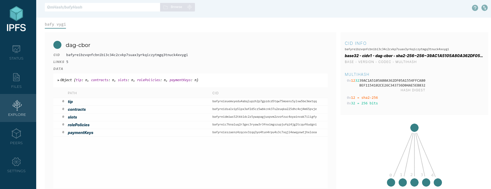

# IPLD indexes for Marlowe contracts and transactions

The following decentralized, distributed indexes of all Marlowe contracts and transactions on the public Cardano networks are updated each time a Marlowe transaction appears in a block.

| Cardano Network | IPNS Path                                                                                                                                                     |
|-----------------|---------------------------------------------------------------------------------------------------------------------------------------------------------------|
| mainnet         | [ipns://k51qzi5uqu5dhj6f1p3fvqsa5w8g9h0n743z09qgej8ospj168o8tnpjx0dvuc](https://ipfs.io/ipns/k51qzi5uqu5dhj6f1p3fvqsa5w8g9h0n743z09qgej8ospj168o8tnpjx0dvuc/) |
| preprod         | [ipns://k51qzi5uqu5dj0n55cl386ll3cbkn455wq2ugweybi4c9qnc1439u2mtxzrpor](https://ipfs.io/ipns/k51qzi5uqu5dj0n55cl386ll3cbkn455wq2ugweybi4c9qnc1439u2mtxzrpor/) |
| preview         | [ipns://k51qzi5uqu5djo1l6k36ij1fichepfdbrib9fdnt82qblf4mkf9t03u3q7na34](https://ipfs.io/ipns/k51qzi5uqu5djo1l6k36ij1fichepfdbrib9fdnt82qblf4mkf9t03u3q7na34/) |

If your IPFS node has difficulty resolving these IPNS links, use `ipfs swarm connect /ip4/thelio.functionally.dev/tcp/4001/p2p/12D3KooWDAbMfusVGjZKFBQT5ngJ5v7tGmo2XDRTAQs37Dgpb5W6` to assist their discovery.


## Format

Currently, the root of the index contains five entries in IPLD's [DAG-CBOR](http://ipld.io.ipns.localhost:8080/docs/codecs/known/dag-cbor/) codec:

- `tip`: information on the block with the most recent Marlowe transaction.
- `contracts`: an index from contract ID to the list of transaction information for the contract.
- `slots`: an index from slot number to list of the IDs of the contracts created in that slot.
- `rolePolicies`: an index from the Marlowe role currency's policy ID to the list of the IDs of contracts using that policy.
- `paymentKeys`: an index from the 28-byte payment credential hash to the list of IDs of contracts mentioning the corresponding address.

The indices are stored as a [radix trie](https://en.wikipedia.org/wiki/Radix_tree), so finding the key for a leaf involves concatenating the prefixes along the path to reach the leaf.


## Limitations

[The indexing software](https://github.com/bwbush/marlowe-ici) currently has the following limitations:

- The payment credentials in merkleized continuations of contracts are not indexed.
- Rollbacks of transactions are not handled gracefully.
- The transaction index number in contract IDs is padded with leading zeros.


## Building

Use `nix build github:bwbush/marlowe-ici#marlowe-ici` to build using Nix.

The `marlowe-ici` tool can also be build with GHC 9.2.8, with or without a Nix environment:

```bash
nix develop
cabal build
```


## Running

This tool requires a connection to the `marlowe-proxy` service of [Marlowe Runtime](https://input-output-hk/marlowe-cardano).

Use `nix run github:bwbush/marlowe-ici#marlowe-ici` to run using Nix.

```bash
marlowe-ici --help
```

```console
marlowe-ici : build IPLD indexes for Marlowe

Usage: marlowe-ici [--version] [--host HOST] [--port PORT] --ipns-key KEY_NAME 
                   [--chunk-size INTEGER] [--batch-size INTEGER] 
                   [--batch-slot SLOT_NO]

  This command-line tool builds and publishes IPLD indexes of Marlowe contracts
  and transactions.

Available options:
  -h,--help                Show this help text
  --version                Show version
  --host HOST              Host for Marlowe proxy service.
                           (default: "localhost")
  --port PORT              Port for Marlowe proxy service. (default: 3700)
  --ipns-key KEY_NAME      The name of the IPNS key for publishing.
  --chunk-size INTEGER     The chunk size for IPFS CAR files. (default: 1000)
  --batch-size INTEGER     The batch size for the initial IPLD puts.
                           (default: 1000)
  --batch-slot SLOT_NO     The last slot for batching IPLD puts.
                           (default: 35000000)
```


## Examples

The IPFS explorer provides a convenient graphical interface for navigating the indexes.




### View the root of the indices

```bash
ipfs dag get /ipns/k51qzi5uqu5dj0n55cl386ll3cbkn455wq2ugweybi4c9qnc1439u2mtxzrpor | json2yaml
```

```yaml
contracts:
  /: bafyreici5vayozdmedwjjqmhbjj3pci5xlg3oo4gqaatqpw7ke3ueyir54
paymentKeys:
  /: bafyreiddymhv64su3opkm2jahzhzvwrzlezvyyqme4h33t2b7rc7hnldym
rolePolicies:
  /: bafyreibyvtru3z6tppqskagzksw33dfk6sly4d6z5mdjicuvwd3oxpugcu
slots:
  /: bafyreifkmehnkjh77qsoxebvtpzahh6ewh2krz6wdmrnhi57q3oh4fzmwu
tip:
  /: bafyreihm4isuj5tjug25rloyag4vucficforrhq5mwdbzmle46fepm4ilq
```


### View the block information for the most recent Marlowe transaction

```bash
ipfs dag get /ipns/k51qzi5uqu5dj0n55cl386ll3cbkn455wq2ugweybi4c9qnc1439u2mtxzrpor/tip | json2yaml
```

```yaml
blockNo: 1819531
headerHash: 7682edf2ccff5142680fec4a9dc358aeaab47a401b95f69d6380930a2a3fe991
slotNo: 49649342
```


### View the transaction information for a particular contract

Let us find information for the Marlowe contract [f1b8e8a7e99b2cc890bde4ad190f29a30a8cb83b3d50d986af88433128fb756e#]().

```bash
ipfs dag get /ipns/k51qzi5uqu5dj0n55cl386ll3cbkn455wq2ugweybi4c9qnc1439u2mtxzrpor/contracts/f1/b8/e8a7e99b2cc890bde4ad190f29a30a8cb83b3d50d986af88433128fb756e#001 | json2yaml
```

```yaml
items:
- /: bafyreievgbcav6crglhxkxbb4od2lnufsut6onbb4ixxdw23hdtvm27o6q
- /: bafyreibd7aflotva5zxxwjzb3fhi4ll6tm6fh244b32zsyiubbyr65vzai
- /: bafyreicwutsbmehfcqyunezgfmy42bajj7muam2xruekom7palkmwyjb6e
```

The creation transaction is first in the list.

```bash
ipfs dag get /ipfs/bafyreievgbcav6crglhxkxbb4od2lnufsut6onbb4ixxdw23hdtvm27o6q | json2yaml
```

```yaml
createStep:
  createOutput:
    address: 706a9391d6aa51af28dd876ebb5565b69d1e83e5ac7861506bd29b56b0
    assets:
      ada: 1500000
      tokens: []
    datum:
      marloweContract:
        timeout: 1672428743000
        timeout_continuation: close
        when:
        - case:
            choose_between:
            - from: 0
              to: 1000000000000000000
            for_choice:
              choice_name: ADAGBP
              choice_owner:
                address: addr_test1qqzg379vgpjnm3n5kffdqq86sr6veng453rfnu07c8y9umdn3kr657fpa3q8mzwmjqvl9lqdn9g2pm3ejhlgwpprwy2swc7lhj
          then:
            timeout: 1672428743000
            timeout_continuation: close
            when:
            - case:
                choose_between:
                - from: 0
                  to: 1000000000000000000
                for_choice:
                  choice_name: ADAJPY
                  choice_owner:
                    address: addr_test1qqzg379vgpjnm3n5kffdqq86sr6veng453rfnu07c8y9umdn3kr657fpa3q8mzwmjqvl9lqdn9g2pm3ejhlgwpprwy2swc7lhj
              then: close
      marloweParams:
        rolesCurrency: ''
      marloweState:
        accounts:
        - - - address: addr_test1qp5e9feu4hkp4qwvgqasq02na05z3eg33zzjquf2d86e6qzznwng4gtlladnxm7d486psa003jy6dv230t82rvv3pflq62lz84
            - currency_symbol: ''
              token_name: ''
          - 1500000
        boundValues: []
        choices: []
        minTime: 0
    utxo:
      txId: f1b8e8a7e99b2cc890bde4ad190f29a30a8cb83b3d50d986af88433128fb756e
      txIx: 1
  metadata:
    marloweMetadata: null
    transactionMetadata: {}
  payoutValidatorHash: 49076eab20243dc9462511fb98a9cfb719f86e9692288139b7c91df3
version: v1
```

That is followed by an application of inputs.

```bash
ipfs dag get /ipfs/bafyreibd7aflotva5zxxwjzb3fhi4ll6tm6fh244b32zsyiubbyr65vzai | json2yaml
```

```yaml
marloweInput:
  marloweAddress: 706a9391d6aa51af28dd876ebb5565b69d1e83e5ac7861506bd29b56b0
  marloweVersion: v1
  payoutValidatorHash: 49076eab20243dc9462511fb98a9cfb719f86e9692288139b7c91df3
  txOutRef:
    txId: f1b8e8a7e99b2cc890bde4ad190f29a30a8cb83b3d50d986af88433128fb756e
    txIx: 1
marloweTransaction:
  blockHeader:
    blockNo: 461521
    headerHash: 1b1bb2ac4dc26e065f5352884e35adfebbdba1ab02c79185fd3aae388c7bcf41
    slotNo: 16729920
  contractId: f1b8e8a7e99b2cc890bde4ad190f29a30a8cb83b3d50d986af88433128fb756e#1
  inputs:
  - for_choice_id:
      choice_name: ADAGBP
      choice_owner:
        address: addr_test1qqzg379vgpjnm3n5kffdqq86sr6veng453rfnu07c8y9umdn3kr657fpa3q8mzwmjqvl9lqdn9g2pm3ejhlgwpprwy2swc7lhj
    input_that_chooses_num: 20012200
  metadata:
    marloweMetadata: null
    transactionMetadata: {}
  output:
    payouts: []
    scriptOutput:
      address: 706a9391d6aa51af28dd876ebb5565b69d1e83e5ac7861506bd29b56b0
      assets:
        ada: 1500000
        tokens: []
      datum:
        marloweContract:
          timeout: 1672428743000
          timeout_continuation: close
          when:
          - case:
              choose_between:
              - from: 0
                to: 1000000000000000000
              for_choice:
                choice_name: ADAJPY
                choice_owner:
                  address: addr_test1qqzg379vgpjnm3n5kffdqq86sr6veng453rfnu07c8y9umdn3kr657fpa3q8mzwmjqvl9lqdn9g2pm3ejhlgwpprwy2swc7lhj
            then: close
        marloweParams:
          rolesCurrency: ''
        marloweState:
          accounts:
          - - - address: addr_test1qp5e9feu4hkp4qwvgqasq02na05z3eg33zzjquf2d86e6qzznwng4gtlladnxm7d486psa003jy6dv230t82rvv3pflq62lz84
              - currency_symbol: ''
                token_name: ''
            - 1500000
          boundValues: []
          choices:
          - - choice_name: ADAGBP
              choice_owner:
                address: addr_test1qqzg379vgpjnm3n5kffdqq86sr6veng453rfnu07c8y9umdn3kr657fpa3q8mzwmjqvl9lqdn9g2pm3ejhlgwpprwy2swc7lhj
            - 20012200
          minTime: 1672413064000
      utxo:
        txId: 580fdc2eea09123cd137c06e61fab8263a79a507454797a59ba57a4166b87581
        txIx: 1
  transactionId: 580fdc2eea09123cd137c06e61fab8263a79a507454797a59ba57a4166b87581
  validityLowerBound: '2022-12-30T15:11:04Z'
  validityUpperBound: '2022-12-30T19:32:23Z'
marloweVersion: v1
```

The final transaction closes the contract.

```bash
ipfs dag get /ipfs/bafyreicwutsbmehfcqyunezgfmy42bajj7muam2xruekom7palkmwyjb6e | json2yaml
```

```yaml
marloweInput:
  marloweAddress: 706a9391d6aa51af28dd876ebb5565b69d1e83e5ac7861506bd29b56b0
  marloweVersion: v1
  payoutValidatorHash: 49076eab20243dc9462511fb98a9cfb719f86e9692288139b7c91df3
  txOutRef:
    txId: 580fdc2eea09123cd137c06e61fab8263a79a507454797a59ba57a4166b87581
    txIx: 1
marloweTransaction:
  blockHeader:
    blockNo: 461524
    headerHash: 1ff4153202ee464c37bfc9cf0c162e2c20bae2006f81c16fb596431b6ff85d5a
    slotNo: 16729957
  contractId: f1b8e8a7e99b2cc890bde4ad190f29a30a8cb83b3d50d986af88433128fb756e#1
  inputs:
  - for_choice_id:
      choice_name: ADAJPY
      choice_owner:
        address: addr_test1qqzg379vgpjnm3n5kffdqq86sr6veng453rfnu07c8y9umdn3kr657fpa3q8mzwmjqvl9lqdn9g2pm3ejhlgwpprwy2swc7lhj
    input_that_chooses_num: 3184000000
  metadata:
    marloweMetadata: null
    transactionMetadata: {}
  output:
    payouts: []
    scriptOutput: null
  transactionId: 407c29a8a36e285933491cef8cb839f39b4bf8a50cc113a00335dd01418a4441
  validityLowerBound: '2022-12-30T15:12:30Z'
  validityUpperBound: '2022-12-30T19:32:23Z'
marloweVersion: v1
```

### Find the contracts for an address

First determine the 28 bytes of the payment credential.

```bash
marlowe-cli util decode-bech32 addr_test1qqzg379vgpjnm3n5kffdqq86sr6veng453rfnu07c8y9umdn3kr657fpa3q8mzwmjqvl9lqdn9g2pm3ejhlgwpprwy2swc7lhj
```

```console
Human-readable part: addr_test
000488f8ac40653dc674b252d000fa80f4cccd15a44699f1fec1c85e6db38d87aa7921ec407d89db9019f2fc0d9950a0ee3995fe8704237115
```

Thus, the payment credential is `0488f8ac40653dc674b252d000fa80f4cccd15a44699f1fec1c85e6d`.

Now fetch the list of contract IDs associated with this credential.

```bash
ipfs dag get /ipns/k51qzi5uqu5dj0n55cl386ll3cbkn455wq2ugweybi4c9qnc1439u2mtxzrpor/paymentKeys/04/88/f8ac40653dc674b252d000fa80f4cccd15a44699f1fec1c85e6d | json2yaml | wc -l
```

```console
77
```


### Find the contracts for a give roles currency policy ID

Let us find the first contract ID that uses the roles currency `a30c223ccc19df287ece74e257b9ebb802e6b863c756d2e6ac4c0054`.

```bash
ipfs dag get /ipns/k51qzi5uqu5dj0n55cl386ll3cbkn455wq2ugweybi4c9qnc1439u2mtxzrpor/rolePolicies/a3/0c/223ccc19df287ece74e257b9ebb802e6b863c756d2e6ac4c0054/items/0            
```

```console
"ede51604c76c6aca4227a2b39f287934e62543b4845cd48ffd955f6d71c6a643#1"
```
